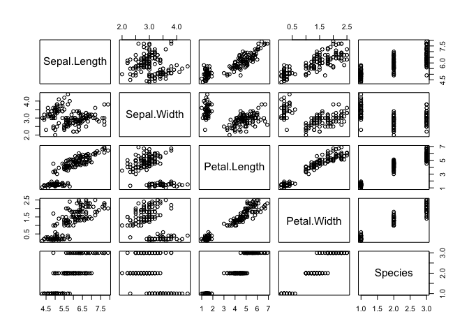

Programming Background
================
Li Wang
6/9/2022

``` r
rmarkdown::render("../_Rmd/2022-06-09-blog-post-Module5.Rmd", 
                  output_format = "github_document",
                  output_dir = "../_posts",
                  output_options = list(
                    html_preview= FALSE
                    )
)
```

## 1\. My thoughts on R vs Python:

### Key Similarities:

R and Python are programming languages and both these languages are
similar in few ways. They are free to download and use; They are used
majorly in data science.

### Key Differences:

R mainly focuses on the statistical part of a project while Python is
flexible in its usage and data analysis tasks.

R is a powerful tool for visualizing data in the form of graphs. It is
difficult to use R in a production environment due to its yet-to-develop
production tools, whereas Python is easily integrated with a complex
work environment.

Python is a better option as it runs faster in all the environments than
R.

## 2\. What functionality do I like about R?

### Open Source:

R is an open-source language and is free to download and use.

### Platform independent:

R is platform-independent and can work on all the operating systems like
UNIX, Windows, and Mac.

### Data Wrangling:

Through its packages like readr and dplyr, R has the capability of
converting a messy code into a structured one.

### Package Availability:

R has numerous packages dedicated to the development of machine
learning, data analysis, and statistical projects.

### Plots and Graphs:

Through ggplot and plotly, R creates attractive graphs with notations
and formulas.

## R Markdown output

``` r
plot(iris)
```

<!-- -->

## 3\. What parts do I miss about your other language?

Slow Runtime: R is a slow processing language. In comparison to other
languages such as Python, it takes more time to give an output.

Difficult to learn: Unlike Python, R is a complicated language and is
difficult for a beginner to learn.

It is difficult to use R in a production environment due to its
yet-to-develop production tools, whereas Python is easily integrated
with a complex work environment.

## 4\. Do I consider R a difficult language to learn?

I think R is difficult for a beginner to learn because it’s so different
to many programming languages. The syntax of R, unlike languages like
Python, is very difficult to read. What’s more, basic operations like
selecting, naming and renaming variables in R are more confusing than
they are in other languages.
